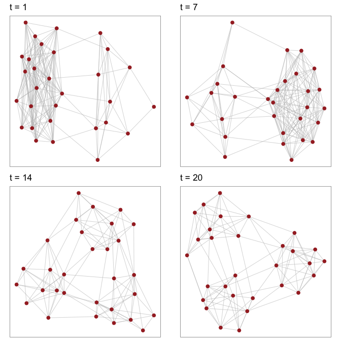
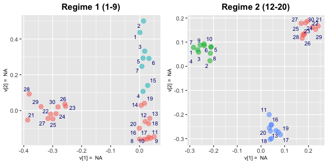
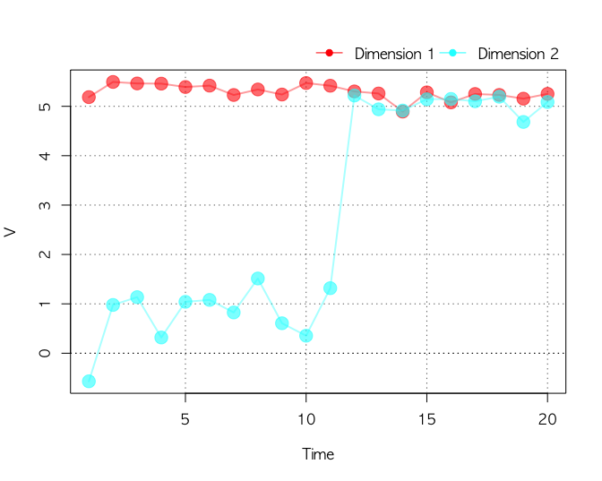
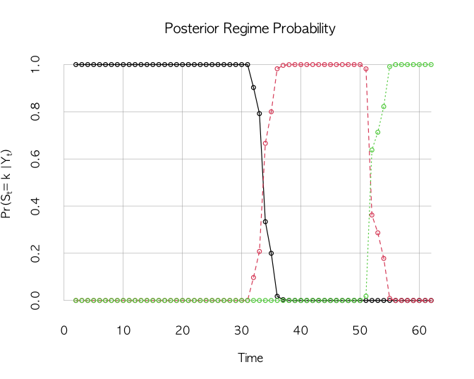
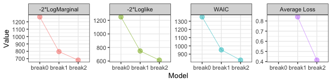
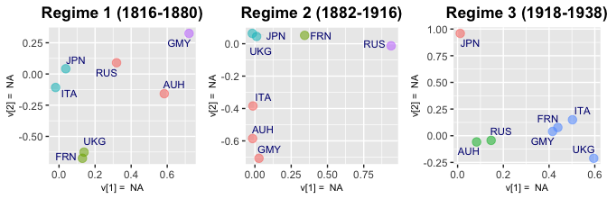
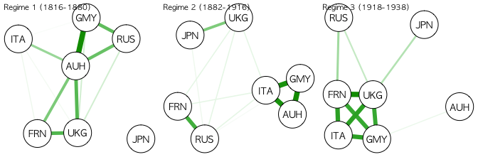

# NetworkChange

[](https://CRAN.R-project.org/package=NetworkChange)
[](https://www.gnu.org/licenses/gpl-3.0)

**Bayesian Hidden Markov Network Change Point Analysis**

Detect structural changes in longitudinal network data using Bayesian multilinear tensor decomposition with hidden Markov models.

## Overview

Many recorded network data span over a long period of time. Researchers often wish to detect "structural changes," "turning points," or "critical junctures" from these network data to answer substantively important questions. For example, the evolution of military alliance networks in international politics has been known to experience several breaks due to world wars and the end of Cold War. However, statistical methods to uncover network changes have been few and far between.

`NetworkChange` is an R package that detects structural changes in longitudinal network data using the latent space approach. Based on the Bayesian multi-array representation of longitudinal networks (Hoff 2011, 2015), `NetworkChange` performs Bayesian hidden Markov analysis (Chib 1998) to discover changes in structural network features across temporal layers.

**Key capabilities:**
- Handle various forms of network changes: block-splitting, block-merging, and core-periphery changes
- Model diagnostics using WAIC, average loss, and log marginal likelihoods
- Visualization tools for dynamic analysis of longitudinal networks


---

## Installation

```r
# From GitHub (development version)
devtools::install_github("jongheepark/NetworkChange")

# From CRAN
install.packages("NetworkChange")
```

## What's New in Version 1.0.0

- **30-50% faster MCMC** through vectorized matrix operations
- **Modern ggplot2 visualizations** with colorblind-friendly viridis palettes
- **Cross-platform compatibility** - works on Windows, Mac, and Linux
- **Patchwork integration** for flexible multi-panel layouts

---

## Quick Example

```r
library(NetworkChange)

# Generate network data with a structural break
set.seed(1973)
Y <- MakeBlockNetworkChange(n = 10, shape = 10, T = 40, type = "split")

# Fit model with 1 changepoint
fit <- NetworkChange(Y, R = 2, m = 1, mcmc = 1000, burnin = 1000, verbose = 100)
```

---

## Visualization Gallery

### 1. Network Array Visualization

View snapshots of your network data over time:

```r
plotnetarray(Y, n.graph = 4)
```



Shows network structure at different time points to visually identify potential regime changes.

---

### 2. Latent Node Positions (`plotU`)

Visualize how nodes cluster in the latent space across different regimes:

```r
plotU(fit)
```



Each panel shows the latent positions for a detected regime. Node labels highlight the most influential actors (based on distance from origin).

**Key features:**
- Automatic regime detection and labeling
- Size indicates node importance
- Labels for top nodes (customizable via `label.prob`)

---

### 3. Layer-Specific Network Rules (`plotV`)

Track how network generation rules evolve over time:

```r
plotV(fit)
```



Each dimension captures a different aspect of network structure. Changes in V indicate shifts in how the network is generated.

**Key features:**
- Colorblind-friendly viridis palette
- Publication-ready ggplot2 output
- Clear visualization of temporal dynamics

---

### 4. Contour Density Plot (`plotContour`)

Examine uncertainty in latent positions:

```r
plotContour(fit)
```

Contour lines show the posterior density of node positions, revealing clustering patterns and estimation uncertainty.

---

### 5. Regime-Specific Cluster Analysis (`drawPostAnalysis`)

Perform k-means clustering within each regime:

```r
p_list <- drawPostAnalysis(fit, Y, n.cluster = c(3, 3))
patchwork::wrap_plots(p_list, ncol = 2)
```

Identifies distinct groups of nodes in each regime with automatic cluster coloring.

---

### 6. Break Diagnostics (`BreakDiagnostic`)

Visualize the posterior distribution of changepoint locations:

```r
BreakDiagnostic(fit)
```



Shows when structural breaks occurred with uncertainty quantification.

---

## Model Comparison

### Compare Models with Different Numbers of Breaks

```r
# Fit models with 0, 1, and 2 breaks
fit0 <- NetworkStatic(Y, R = 2, mcmc = 1000, burnin = 1000)
fit1 <- NetworkChange(Y, R = 2, m = 1, mcmc = 1000, burnin = 1000)
fit2 <- NetworkChange(Y, R = 2, m = 2, mcmc = 1000, burnin = 1000)

# Compare via WAIC
WaicCompare(list(fit0, fit1, fit2), print = TRUE)

# Compare via Marginal Likelihood
MarginalCompare(list(fit0, fit1, fit2), print = TRUE)
```



---

## Real Data Example: Major Power Alliances

```r
# Load alliance network data (1816-2012)
data(MajorAlly)

# Fit model with 2 changepoints
fit <- NetworkChange(MajorAlly, R = 2, m = 2,
                     mcmc = 10000, burnin = 10000,
                     verbose = 1000)

# Visualize regime-specific latent spaces
plotU(fit, Time = 1816:2012)

# Layer-specific dynamics
plotV(fit)

# Cluster analysis
drawPostAnalysis(fit, MajorAlly, n.cluster = c(4, 4, 3))
```





---

## Key Functions Reference

| Function | Purpose |
|----------|---------|
| `NetworkChange()` | Fit changepoint model |
| `NetworkStatic()` | Fit static model (no changepoints) |
| `plotU()` | Latent node positions by regime |
| `plotV()` | Layer-specific network rules over time |
| `plotContour()` | Posterior density of latent positions |
| `plotnetarray()` | Network snapshots over time |
| `drawPostAnalysis()` | Regime-specific clustering |
| `BreakDiagnostic()` | Changepoint location diagnostics |
| `WaicCompare()` | Model comparison via WAIC |
| `MarginalCompare()` | Model comparison via marginal likelihood |

---

## Customizing Visualizations

All plots use the unified `theme_networkchange()` theme:

```r
library(ggplot2)

# Customize any plot
plotV(fit) +
  ggtitle("My Custom Title") +
  theme_networkchange(base_size = 14)

# Use package color scales
ggplot(data, aes(x, y, color = group)) +
  geom_point() +
  scale_color_networkchange()
```

---

## Citation

If you use NetworkChange in your research, please cite:

> Park, Jong Hee and Yunkyun Sohn. 2020. "Detecting Structural Change in Longitudinal Network Data." *Bayesian Analysis*. 15(1): 133-157.

```bibtex
@article{park2020detecting,
  title={Detecting Structural Change in Longitudinal Network Data},
  author={Park, Jong Hee and Sohn, Yunkyun},
  journal={Bayesian Analysis},
  volume={15},
  number={1},
  pages={133--157},
  year={2020},
  doi={10.1214/19-BA1150}
}
```

---

## License

GPL-3

## Authors

- **Jong Hee Park** - Seoul National University
- **Yunkyun Sohn** - Baruch College, CUNY
