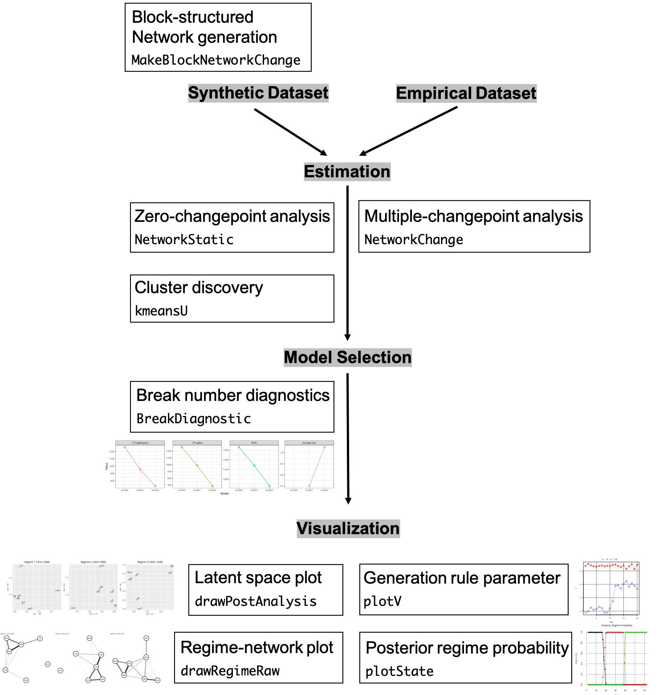

# Summary

**NetworkChange** is an R package that detects multiple structural
changes in longitudinal network data using the latent space approach [@hoff2002latent].
Based on the Bayesian multi-array representation of longitudinal
networks [@Hoff2015], **NetworkChange** performs
Bayesian hidden Markov analysis to discover changes in structural
network features across temporal layers using the hidden Markov model formulation. **NetworkChange** can detect
various forms of changes in network structure such as block-splitting, block-merging,
and core-periphery changes. **NetworkChange** also provides functions
for model diagnostics using WAIC, average loss, and log marginal
likelihoods as well as visualization tools for dynamic analysis results
of longitudinal networks. 

The package is designed for R users who need to analyze longitudinal network data to discover latent node-level characteristics including cases when there are discrete changes of the underlying states governing the node-level characteristics. This is in contrast to an R package for latent space and cluster analysis of networks [@krivitsky2008fitting] which does not incorporate a state space model (e.g. hidden Markov model) and a Python code for longitudinal network analysis [@peel2015detecting] under a distinct formulation (hierarchical random graph model) with a changepoint detection function. In addition to functions for the statistical analysis, **NetworkChange** provides visualization functions for summary of the analysis results (\autoref{fig:list}). The complete guide for using core functions of the package is presented at https://github.com/jongheepark/NetworkChange as its vignette with an empirical data set analysis example. @ParkSohn2020 provide methodological details of the algorithms implemented in our package. 

# Acknowledgements

This work was supported by the Japan Society for the Promotion of Science Early-Career Scientists Grant [JP19K13606] to Y.S.

# References