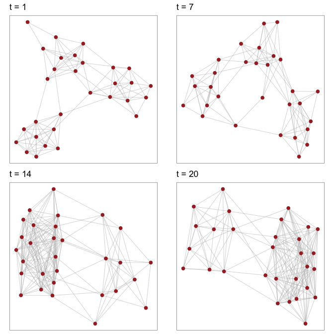
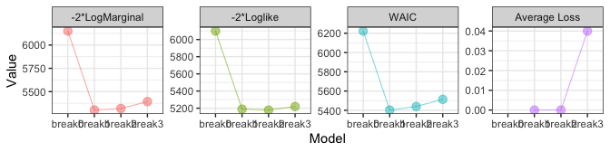

<!-- README.md is generated from README.Rmd. Please edit that file -->

# NetworkChange

`NetworkChange` is an *R* package that detects structural changes in
longitudinal network data using the latent space approach. Based on the
Bayesian multi-array representation of longitudinal networks.

`NetworkChange` performs Bayesian hidden Markov analysis (Chib 1998) to
discover changes in structural network features across temporal layers.
`NetworkChange` can handle various forms of network changes such as
block-splitting, block-merging, and core-periphery changes.
`NetworkChange` also provides functions for model diagnostics using
WAIC, average loss, and log marginal likelihoods as well as
visualization tools for dynamic analysis results of longitudinal
networks.

## install

``` r
## from CRAN
## install.packages("NetworkChange")

## most recent version from github
## you need to install devtools package first
## devtools::install_github("jongheepark/NetworkChange")

library(NetworkChange)
#> Loading required package: MCMCpack
#> Loading required package: coda
#> Loading required package: MASS
#> ##
#> ## Markov Chain Monte Carlo Package (MCMCpack)
#> ## Copyright (C) 2003-2022 Andrew D. Martin, Kevin M. Quinn, and Jong Hee Park
#> ##
#> ## Support provided by the U.S. National Science Foundation
#> ## (Grants SES-0350646 and SES-0350613)
#> ##
#> Registered S3 method overwritten by 'GGally':
#>   method from   
#>   +.gg   ggplot2
```

<div class="figure">


<p class="caption">

Summary of selected features and functions of the package.

</p>

</div>

## Input network data and synthetic data generation

Input data for `NetworkChange` takes an array form. Hence, the dimension
of input data is \(N \times N \times T\). Currently, `NetworkChange`
allows longitudinal data of symmetric (\(i.e.\) undirected) networks.

One quick way to generate a synthetic longitudinal network data set with
a changepoint is to call `MakeBlockNetworkChange().` It has three
clusters by default and users can choose the size of data by selecting
the number of nodes in each cluster (\(n\)) and the length of time
(\(T\)). For example, if one chooses \(n=10\) and \(T=20\), an array of
\(30 \times 30 \times 20\) is generated. `base.prob` is the
inter-cluster link probability, and `block.prob`+`base.prob` is the
intra-cluster link probability. When one sets `block.prob>0`, a
clustered network data set is generated. If `block.prob=0`, we have a
random network data set.

``` r
set.seed(11173)
n <- 10 ## number of nodes in each cluster
Y <- MakeBlockNetworkChange(n=n, break.point = .5,
                            base.prob=.05, block.prob=.7,
                            T=20, type ="split")
dim(Y)
#> [1] 30 30 20
```

The above code generates a longitudinal network data set with a
changepoint in the middle (`break.point=0.5`). We specify the type of
network change as a block-splitting change (\`type =“split”}) where the
initial two cluster network splits into three clusters.

Currently, `MakeBlockNetworkChange()` provides five different options of
network changes (`type`): “constant”, “merge”, “split”, “merge-split”,
and “split-merge.” If “constant” is chosen, the number of breaks is
zero. If “merge” or “split” is chosen, the number of breaks is one. If
either “merge-split” or “split-merge” is chosen, the number of breaks is
two.

Users can use `plotnetarray()` to visualize the longitudinal network
data. The resulting plot shows a selected number of equi-distant
time-specific networks. By default, `n.graph` is 4. Users can change
plot settings by changing options in `ggnet`.

``` r
plotnetarray(Y)
```


A block-merged data set can be generated by settting `type ="merge"` of
`MakeBlockNetworkChange()`. We draw 4 snapshots using `plotnetarray()`.

``` r
set.seed(11173)
Ymerge <- MakeBlockNetworkChange(n=n, break.point = .5,
                               base.prob=.05, block.prob=.7,
                               T=20, type ="merge")
plotnetarray(Ymerge)
```



## Latent space discovery

In this section, We estimate the chagepoints of the block-splitting data
set `Y` generated above. We fit a HNC using the principal eigen-matrix
for degree correction.

``` r
G <- 100
Yout <-  NetworkChange(Y, R=2, m=1, mcmc=G, burnin=G, verbose=0)
#> Initializing using the Alternating Least Squares Method: # of iteration =  10
```

We then use `drawPostAnalysis()` to draw latent node positions obtained
from HNC. We also highlight the latent cluster structure using the
\(k\)-means clustering method over the estimated latent node positions
of each regime. `drawPostAnalysis()` provides an option to include
k-means clustering results of the latent node positions for each regime.
`n.cluster` sets the number of clusters in each regime. The clustering
results are depicted by assigning unique colors over the clusters. These
two functions, plotting the latent node coordinates and k-means
clustering, can also be applied separately by using `plotU` and
`kmeansU` respectively.

``` r
Ydraw <- drawPostAnalysis(Yout, Y, n.cluster=c(2,3))
#> Warning in mean.default(newX[, i], ...): argument is not numeric or logical:
#> returning NA

#> Warning in mean.default(newX[, i], ...): argument is not numeric or logical:
#> returning NA

#> Warning in mean.default(newX[, i], ...): argument is not numeric or logical:
#> returning NA

#> Warning in mean.default(newX[, i], ...): argument is not numeric or logical:
#> returning NA
multiplot(plotlist=Ydraw, cols=2)
#> Warning: ggrepel: 3 unlabeled data points (too many overlaps). Consider
#> increasing max.overlaps
```

 As
shown by the difference between the distributions of the latent node
traits, the clusters in regime 1 can be clearly distinguished by their
coordinates on the first dimension whereas both dimensional coordinates
are required to distinguish the three clusters in regime 2.

Such transition of the group structure can be easily depicted by
plotting the change of the network generation rule parameters (\(\v_t\))
over time. `plotV` allows one to draw such patterns. While the first
dimensional generation rule parameter \(v_1\) exhibits constaly high
values over the entire period, the second dimensional generation rule
parameter rises dramatically near \(t=10\), the ground truth changepoint
.

``` r
plotV(Yout, cex=2)
```


## Break number diagnostics

Although the above analysis shows suggestive evidence in favor of a
single network changepoint, it does not provide a statistical judgement
criterion for determining the break number parameter of HNC. Model
diagnostics is required to coose an appropriate number of breaks and
derive the final modeling result.

`BreakDiagnostic()` allows one to check a statistically supported number
of breaks by fitting multiple HNC models with a varying number of
breaks. `break.upper` setting allows one to choose the upper limit of
break numbers to be examined.

``` r
set.seed(1223)
G <- 100
detect <- BreakDiagnostic(Y, R=2, mcmc=G, burnin=G, verbose=0, break.upper=3)
```

Users can draw plots of diagnostic results by calling the first element
of the test object.

``` r
detect[[1]]
#> Warning: Removed 1 row(s) containing missing values (geom_path).
#> Warning: Removed 1 rows containing missing values (geom_point).
```



Otherwise, users can print out the numerical results which is stored in
the second element of the test object.

``` r
print(detect[[2]])
#> $LogMarginal
#> [1] -3075.330 -2651.176 -2659.268 -2696.535
#> 
#> $Loglike
#> [1] -3049.776 -2594.429 -2589.197 -2610.019
#> 
#> $WAIC
#> [1] 6223.589 5402.413 5439.349 5513.796
#> 
#> $`Average Loss`
#> [1] 0.00 0.00 0.04
```

All diagnostic measures clearly indicate that the number of breaks in
the synthetic data is one, agreeing with that of the synthetic data
generating process.

## Empirical data analysis example

In this section, we analyze changes in the international military
alliance network among major powers. The data set is originally from
(Gibler 2008) and users can call this data set by `data(MajorAlly)`.

Our goal in this section is to detect structural changes in the
longitudinal alliance network among major powers using HNC. We follow
the COW dataset’s coding of “major powers” (the United Kingdom, Germany,
Austria-Hungary, France, Italy, Russia, the United States, Japan, and
China) in the analysis. We aggregated every 2 year network from the
original annual binary networks to increase the density of each layer.

``` r
data(MajorAlly)
Y <- MajorAlly
time <- dim(Y)[3]
drop.state <- c(which(colnames(Y) == "USA"), which(colnames(Y) == "CHN"))
newY <- Y[-drop.state, -drop.state, 1:62]
```

First, we fit a pilot model to elicit reasonable inverse gamma prior
values for \(\v_t\) (\(v_0\) and \(v_1\)).

``` r
G <- 100
set.seed(1990)
test.run <- NetworkStatic(newY, R=2, mcmc=G, burnin=G, verbose=0,
                          v0=10, v1=time*2)
V <- attr(test.run, "V")
sigma.mu = abs(mean(apply(V, 2, mean)))
sigma.var = 10*mean(apply(V, 2, var))
v0 <- 4 + 2 * (sigma.mu^2/sigma.var)
v1 <- 2 * sigma.mu * (v0/2 - 1)
```

Then, we diagnose the break number by comparing model-fits of several
models with a varying number of breaks.

``` r
set.seed(11223);
detect2 <- BreakDiagnostic(newY, R=2, break.upper=2,
                           mcmc=G, burnin=G, verbose=0,
                           v0=v0, v1=v1)
detect2[[1]]
#> Warning: Removed 1 row(s) containing missing values (geom_path).
#> Warning: Removed 1 rows containing missing values (geom_point).
```


The test results from WAIC, log marginal likelihood, and average loss
indicate that HNC with two breaks is most reasonable.

Based on the test result, we fit the HNC with two breaks to the major
power alliance network and save the result in *R* object `fit`.

``` r
G <- 100
K <- dim(newY)
m <- 2
initial.s <- sort(rep(1:(m+1), length=K[[3]]))
set.seed(11223);
fit <- NetworkChange(newY, R=2, m=m, mcmc=G, initial.s = initial.s,
                     burnin=G, verbose=0, v0=v0, v1=v1)
```

First, we can examine transitions of hidden regimes by looking at
posterior state probabilities (\(p(\S | \mathcal{Y}, \Theta)\)) over
time. `plotState()` in `MCMCpack` pacakge provides a function to draw
the posterior state probabilities from changepoint analysis results.
Since our input data is an array, we need to change the input data as a
vector.

``` r
attr(fit, "y") <- 1:K[[3]]
plotState(fit, start=1)
```


Next, we draw regime-specific latent node positions of major powers
using `drawPostAnalysis`. Users can choose the number of clusters in
each regime by \`n.cluster}.

``` r
p.list <- drawPostAnalysis(fit, newY, n.cluster=c(4, 4, 3))
#> Warning in mean.default(newX[, i], ...): argument is not numeric or logical:
#> returning NA

#> Warning in mean.default(newX[, i], ...): argument is not numeric or logical:
#> returning NA

#> Warning in mean.default(newX[, i], ...): argument is not numeric or logical:
#> returning NA

#> Warning in mean.default(newX[, i], ...): argument is not numeric or logical:
#> returning NA

#> Warning in mean.default(newX[, i], ...): argument is not numeric or logical:
#> returning NA

#> Warning in mean.default(newX[, i], ...): argument is not numeric or logical:
#> returning NA
multiplot(plotlist = p.list, cols=3)
```


Then, using `drawRegimeRaw()`, we can visualize original network
connections for each regime by collapsing network data within each
regime.

``` r
drawRegimeRaw(fit, newY)
```


The results are highly interesting to scholars of international
relations and history. We discuss the results in details in (Park and
Sohn 2020). One of the most interesting findings is the centrality of
Austria-Hungary (AUH) during the first two regimes. Austria-Hungary
played a role of broker that connected other major powers between 1816
and 1890. This period roughly overlaps with “the age of Metternich”
(1815-1848) (Rothenberg 1968). Throughout the first two regimes, the
network position of Austria-Hungary remained highly critical in the
sense that the removal of Austria-Hungary would have made the major
power alliance network almost completely disconnected. In the language
of social network analysis, Austria-Hungary filled a “structural hole”
in the major power alliance network at the time, playing the role of
broker (Burt 2009).

Identifying hidden regimes of the military alliance network makes it
clear the central role of Austria-Hungary during the first two regimes
in the military alliance network among major powers.

We believe that `NetworkChange` will increase the capacity for
longitudinal analysis of network data in various fields, not limited to
social sciences.

<div id="refs" class="references">

<div id="ref-Burt2009">

Burt, Ronald S. 2009. *Structural Holes: The Social Structure of
Competition*. Harvard University Press.

</div>

<div id="ref-Chib1998">

Chib, Siddhartha. 1998. “Estimation and Comparison of Multiple
Change-Point Models.” *Journal of Econometrics* 86 (2): 221–41.

</div>

<div id="ref-Gibler2009">

Gibler, Douglas. 2008. *International Military Alliances, 1648-2008*. CQ
Press.

</div>

<div id="ref-Park2020">

Park, Jong Hee, and Yunkyu Sohn. 2020. “Detecting Structural Changes in
Longitudinal Network Data.” *Bayesian Analysis* 15 (1): 133–57.

</div>

<div id="ref-Rothenberg1968">

Rothenberg, Gunther E. 1968. “The Austrian Army in the Age of
Metternich.” *Journal of Modern History* 40 (2): 156–65.

</div>

</div>
