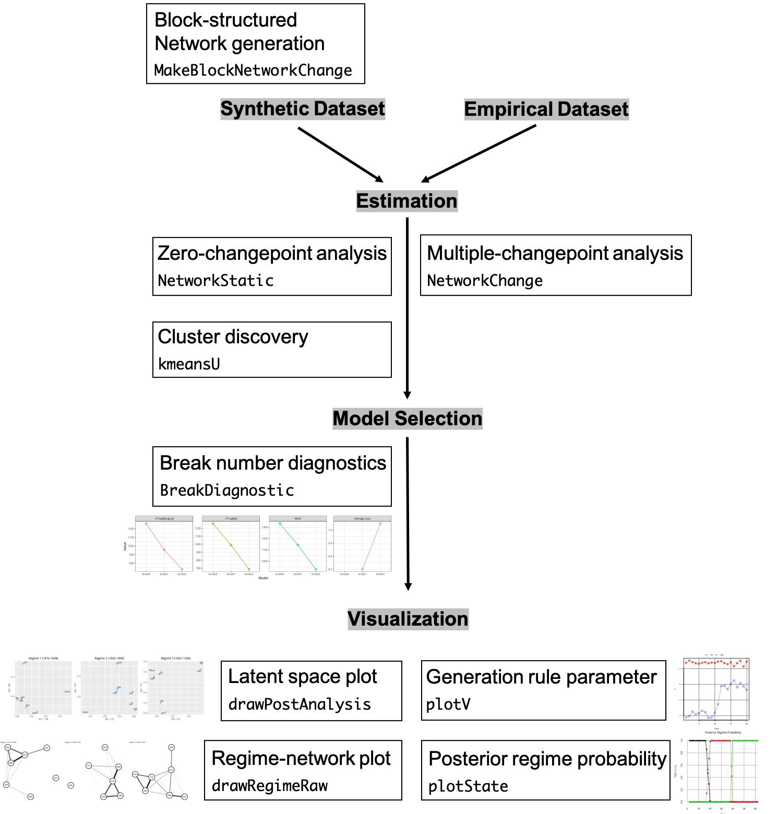

\newcommand{\A}{\mathcal{A}}
\newcommand{\B}{\mathcal{B}}
\newcommand{\Y}{\mathbf{Y}}
\newcommand{\Z}{\mathbf{Z}}
\renewcommand{\E}{\mathbf{E}}
\newcommand{\M}{\mathbf{M}}
\newcommand{\U}{\mathbf{U}}
\newcommand{\V}{\mathbf{V}}
\renewcommand{\L}{\mathbf{L}}
\renewcommand{\u}{\mathbf{u}}
\renewcommand{\v}{\mathbf{v}}
\renewcommand{\l}{\boldsymbol{\lambda}}
\newcommand{\z}{\mathbf{z}}
\newcommand{\y}{\mathbf{y}}
\newcommand{\x}{\mathbf{x}}
\newcommand{\X}{\mathbf{X}}
\newcommand{\W}{\mathbf{W}}
\newcommand{\F}{\mathbf{F}}
\newcommand{\G}{\mathbf{G}}
\newcommand{\R}{\mathbf{R}}
\def\real{\mathbb{R}}
\newcommand{\s}{\mathbf{s}}
\renewcommand{\S}{\mathbf{S}}
\renewcommand{\P}{\mathbf{P}}
\newcommand{\Sig}{\boldsymbol{\Sigma}}
\renewcommand{\a}{\alpha}
\renewcommand{\b}{\boldsymbol{\beta}}
\renewcommand{\t}{\boldsymbol{\theta}}
\newcommand{\T}{\boldsymbol{\Theta}}
\newcommand{\mb}{\mathbf}
\newcommand{\RD}{\mathbf{R}^{D}}
\newcommand{\e}{\boldsymbol{\varepsilon}}
\renewcommand{\r}{\rho}
\newcommand{\g}{\boldsymbol{\gamma}}
\renewcommand{\d}{\boldsymbol{\delta}}
\newcommand{\bs}{\boldsymbol}
\newcommand{\normdist}[2]{\ensuremath{\mathcal{N}(#1,#2)}}
\newcommand{\normdistk}[3]{\ensuremath{\mathcal{N}_{#3}(#1,#2)}}
\newcommand{\wish}[2]{\ensuremath{\mathcal{W}(#1,#2)}}
\newcommand{\invwish}[2]{\ensuremath{\mathcal{IW}(#1,#2)}}
\newcommand{\gamdist}[2]{\ensuremath{\mathcal{G}(#1,#2)}}
\newcommand{\invgam}[2]{\ensuremath{\mathcal{IG}(#1,#2)}}
\newcommand{\studt}[3]{\ensuremath{t_{#3}(#1,#2)}}
\newcommand{\binomial}[2]{\ensuremath{\mathcal{B}in(#1,#2)}}
\newcommand{\bern}[1]{\ensuremath{\mathcal{B}ernoulli(#1)}}
\newcommand{\diri}[1]{\ensuremath{\mathcal{D}irichlet(#1)}}
\newcommand{\unif}[2]{\ensuremath{\mathcal{U}(#1,#2)}}
\newcommand{\chisqr}[1]{\ensuremath{\chi_{#1}^{2}}}
\newcommand{\invchisqr}[1]{\ensuremath{\mathcal{I}nv}\textnormal{-}\ensuremath{\chi_{#1}^{2}}}
\newcommand{\betadist}[2]{\ensuremath{\mathcal{B}eta(#1,#2)}}
\newcommand{\poisson}[1]{\ensuremath{\mathcal{P}oisson(#1)}}
\newcommand{\expo}[1]{\ensuremath{\mathcal{E}xp(#1)}}
\newcommand{\Dir}{\mathrm{Dir}}
\newcommand{\thh}{^\mathrm{th}}
\newcommand{\modtwo}{\mathrm{[mod~2]}}
\newcommand{\thetaof}[2]{\theta \langle #1;#2\rangle}
\newcommand{\Mpa}{M_\mathrm{P,A}}
\newcommand{\Ma}{M_\mathrm{A}}
\newcommand{\rjaccept}{\mathcal{A}}

```{r setup, include=FALSE}
rm(list=ls())
knitr::opts_chunk$set(echo = TRUE)
require(NetworkChange)
require(sna)
require(ggnet)
knitr::opts_chunk$set(
  collapse = TRUE,
  comment = "#>"## , 
  ## eval=FALSE
)
```

## Introduction 

Many recorded network data span over a long period of time. Researchers often wish to detect "structural changes," "turning points," or "critical junctures" from these network data to answer substantively important questions. For example, the evolution of military alliance networks in international politics has been known to experience several breaks due to world wars and the end of Cold War. However, to this date, statistical methods to uncover network changes have been few and far between.

In this vignette, we explain how to use **NetworkChange** for network changepoint analysis.
**NetworkChange** is an **R** package that detects structural changes in longitudinal network data using the latent space approach. Based on the Bayesian multi-array representation of longitudinal networks [@Hoff2011; @Hoff2015], **NetworkChange** performs Bayesian hidden Markov analysis to discover changes in structural network features across temporal layers. **NetworkChange** can handle various forms of network changes such as block-splitting, block-merging, and core-periphery changes. **NetworkChange** also provides functions for model diagnostics using WAIC, average loss, and log marginal likelihoods as well as visualization tools for dynamic analysis results of longitudinal networks.

```{r message=FALSE, warning=FALSE}
library(NetworkChange)
```


```{r, echo=FALSE, fig.cap="\\label{fig:list}Summary of selected features and functions of the package.", out.width = '100%'}

```


## Input network data and synthetic data generation
Input data for **NetworkChange** takes an array form. Hence, the dimension of input data is $N \times N \times T$.  Currently, **NetworkChange** allows longitudinal data of symmetric ($i.e.$ undirected) networks.

One quick way to generate a synthetic longitudinal network data set with a changepoint is to call `MakeBlockNetworkChange`. It has three clusters by default and users can choose the size of data by selecting the number of nodes in each cluster ($n$) and the length of time ($T$). For example, if one chooses $n=10$ and $T=20$, an array of $30 \times 30 \times 20$ is generated. `base.prob` is the inter-cluster link probability, and `block.prob`+`base.prob` is the intra-cluster link probability. When one sets `block.prob>0`, a clustered network data set is generated. If `block.prob=0`, we have a random network data set.
```{r networkdata, warning=FALSE, fig.showtext=TRUE}
set.seed(11173)
n <- 10 ## number of nodes in each cluster
Y <- MakeBlockNetworkChange(n=n, break.point = .5,
                            base.prob=.05, block.prob=.7,
                            T=20, type ="split")
dim(Y)
```

The above code generates a longitudinal network data set with a changepoint in the middle (`break.point=0.5`). We specify the type of network change as a block-splitting change (`type ="split"}) where the initial two cluster network splits into three clusters.

Currently, `MakeBlockNetworkChange` provides five different options of network changes (`type`):  "constant", "merge", "split", "merge-split", and "split-merge." If "constant" is chosen, the number of breaks is zero. If "merge" or "split" is chosen, the number of breaks is one. If either "merge-split" or "split-merge" is chosen, the number of breaks is two.

Users can use `plotnetarray` to visualize the longitudinal network data. The resulting plot shows a selected number of equi-distant time-specific networks. By default, `n.graph} is 4. Users can change plot settings by changing options in *ggnet*.

```{r, fig.cap="\\label{fig:synth1}A synthetic longitudinal network data set generated using the block-splitting setting.", message=FALSE, warning=FALSE, fig.width = 6, fig.height = 6, fig.showtext=TRUE, fig.pos = 'ht'}
plotnetarray(Y)
```

A block-merged data set can be generated by settting `type ="merge"` of `MakeBlockNetworkChange`. We draw 4 snapshots using `plotnetarray`.

```{r, fig.cap="\\label{fig:synth2}A synthetic longitudinal network data set generated using the block-merging setting.", message=FALSE, warning=FALSE, fig.width = 6, fig.height = 6, fig.showtext=FALSE,fig.pos = 'ht'}
set.seed(11173)
Ymerge <- MakeBlockNetworkChange(n=n, break.point = .5,
                               base.prob=.05, block.prob=.7,
                               T=20, type ="merge")
plotnetarray(Ymerge)
```

## Latent space discovery
In this section, We estimate the chagepoints of the block-splitting data set `Y` generated above. We fit a HNC using the principal eigen-matrix for degree correction.
```{r estimation}
G <- 100
Yout <-  NetworkChange(Y, R=2, m=1, mcmc=G, burnin=G, verbose=0)
```
We then use `drawPostAnalysis` to draw latent node positions obtained from HNC. We also highlight the latent cluster structure using the $k$-means clustering method over the estimated latent node positions of each regime. `drawPostAnalysis` provides an option to include k-means clustering results of the latent node positions for each regime. `n.cluster` sets the number of clusters in each regime. The clustering results are depicted by assigning unique colors over the clusters. These two functions, plotting the latent node coordinates and k-means clustering, can also be applied separately by using `plotU` and `kmeansU} respectively.
```{r, fig.cap="\\label{fig:positions}Latent Node Positions obtained using HNC", message=FALSE, warning=FALSE, fig.width = 6, fig.height = 3, fig.showtext=TRUE, fig.pos = 'ht'}
Ydraw <- drawPostAnalysis(Yout, Y, n.cluster=c(2,3))
multiplot(plotlist=Ydraw, cols=2)
```
As shown by the difference between the distributions of the latent node traits in the two graphs of Figure \ref{fig:positions}, the clusters in regime 1 can be clearly distinguished by their coordinates on the first dimension whereas both dimensional coordinates are required to distinguish the three clusters in regime 2.

Such transition of the group structure can be easily depicted by plotting the change of the network generation rule parameters ($\v_t$) over time. `plotV} allows one to draw such patterns. While the first dimensional generation rule parameter $v_1$ exhibits constaly high values over the entire period, the second dimensional generation rule parameter rises dramatically near $t=10$, the ground truth changepoint .

```{r, fig.cap="\\label{fig:plotV}Generation rule parameter $v_t$ over time.", warning=FALSE, fig.width = 5, fig.height = 3.5, fig.pos = 'ht', fig.showtext=TRUE}
plotV(Yout, cex=2)
```

## Break number diagnostics

Although the above analysis shows suggestive evidence in favor of a single network changepoint, it does not provide a statistical judgement criterion for determining the break number parameter of HNC. Model diagnostics is required to coose an appropriate number of breaks and derive the final modeling result.

`BreakDiagnostic` allows one to check a statistically supported number of breaks by fitting multiple HNC models with a varying number of breaks. `break.upper} setting allows one to choose the upper limit of break numbers to be examined.
```{r diag0, warning=FALSE}
set.seed(1223)
G <- 100
detect <- BreakDiagnostic(Y, R=2, mcmc=G, burnin=G, verbose=0, break.upper=3)
```

Users can draw plots of diagnostic results by calling the first element of the test object.
```{r, warning=FALSE, fig.cap="\\label{fig:diagnostic}Break number diagnostics for synthetic block-splitting data.", warning=FALSE, fig.pos = 'ht', out.width = "100%", fig.width = 12, fig.height = 3, fig.showtext=TRUE}
detect[[1]]
```
Otherwise, users can print out the numerical results which is stored in the second element of the test object.
```{r diag2, fig.showtext=TRUE}
print(detect[[2]])
```
All diagnostic measures clearly indicate that the number of breaks in the synthetic data is one, agreeing with that of the synthetic data generating process.

##  Empirical data analysis example

In this section, we analyze changes in the international military alliance network among major powers. The data set is originally from [@Gibler2009] and users can call this data set by `data(MajorAlly)}.

Our goal in this section is to detect structural changes in the longitudinal alliance network among major powers using HNC.  We follow the COW dataset's coding of "major powers" (the United Kingdom,  Germany, Austria-Hungary, France, Italy, Russia, the United States, Japan, and China) in the analysis. We aggregated every 2 year network from the original annual binary networks to increase the density of each layer.


```{r ally}
data(MajorAlly)
Y <- MajorAlly
time <- dim(Y)[3]
drop.state <- c(which(colnames(Y) == "USA"), which(colnames(Y) == "CHN"))
newY <- Y[-drop.state, -drop.state, 1:62]
```

First, we fit a pilot model to elicit reasonable inverse gamma prior values for $\v_t$ ($v_0$ and $v_1$).
```{r test}
G <- 100
set.seed(1990)
test.run <- NetworkStatic(newY, R=2, mcmc=G, burnin=G, verbose=0,
                          v0=10, v1=time*2)
V <- attr(test.run, "V")
sigma.mu = abs(mean(apply(V, 2, mean)))
sigma.var = 10*mean(apply(V, 2, var))
v0 <- 4 + 2 * (sigma.mu^2/sigma.var)
v1 <- 2 * sigma.mu * (v0/2 - 1)
```

Then, we diagnose the break number by comparing model-fits of several models with a varying number of breaks.
```{r, warning=FALSE, fig.cap="\\label{fig:diagnosticsnew}Break number diagnostics for the allaince data set.", warning=FALSE, fig.pos = 'ht', out.width = "100%", fig.width = 12, fig.height = 3, fig.showtext=TRUE}
set.seed(11223);
detect2 <- BreakDiagnostic(newY, R=2, break.upper=2,
                           mcmc=G, burnin=G, verbose=0,
                           v0=v0, v1=v1)
detect2[[1]]
```

The test results from WAIC, log marginal likelihood, and average loss indicate that HNC with two breaks is most reasonable.

Based on the test result, we fit the HNC with two breaks to the major power alliance network and save the result in **R** object `fit}.
```{r hncally}
G <- 100
K <- dim(newY)
m <- 2
initial.s <- sort(rep(1:(m+1), length=K[[3]]))
set.seed(11223);
fit <- NetworkChange(newY, R=2, m=m, mcmc=G, initial.s = initial.s,
                     burnin=G, verbose=0, v0=v0, v1=v1)
```

First, we can examine transitions of hidden regimes by looking at posterior state probabilities ($p(\S | \mathcal{Y}, \Theta)$) over time. `plotState` in \pkg{MCMCpack} provides a function to draw the posterior state probabilities from changepoint analysis results. Since our input data is an array, we need to change the input data as a vector.
```{r, warning=FALSE, fig.cap="\\label{fig:regimeprob}Posterior Regime Probability.", fig.pos = 'ht', out.width = "70%", fig.width = 5.5, fig.height = 4, fig.showtext=TRUE}
attr(fit, "y") <- 1:K[[3]]
plotState(fit, start=1)
```

Next, we draw regime-specific latent node positions of major powers using `drawPostAnalysis`. Users can choose the number of clusters in each regime by `n.cluster}.
```{r, warning=FALSE, fig.cap="\\label{fig:postanalysis}Estimated mean of latent node positions for the recovered 3 regimes.", fig.pos = 'ht', out.width = "100%", fig.width = 12, fig.height = 4, fig.showtext=TRUE}
p.list <- drawPostAnalysis(fit, newY, n.cluster=c(4, 4, 3))
multiplot(plotlist = p.list, cols=3)
```

Then, using `drawRegimeRaw}, we can visualize original network connections for each regime by collapsing network data within each regime.
```{r, warning=FALSE, fig.cap="\\label{fig:regimeraw}Collapsed regime-specific networks.", warning=FALSE, fig.pos = 'ht', out.width = "100%", fig.width = 12, fig.height = 4, fig.showtext=TRUE}
drawRegimeRaw(fit, newY)
```

The results are highly interesting to scholars of international relations and history. We discuss the results in details in [@Park2020]. One of the most interesting findings is the centrality of Austria-Hungary (AUH) during the first two regimes. Austria-Hungary played a role of broker that connected other major powers between 1816 and 1890. This period roughly overlaps with "the age of  Metternich" (1815-1848) [@Rothenberg1968}. Throughout the first two regimes, the network position of Austria-Hungary remained highly critical in the sense that the removal of Austria-Hungary would have made the major power alliance network almost completely disconnected. In the language of social network analysis, Austria-Hungary filled a "structural hole" in the major power alliance network at the time, playing the role of broker [@Burt2009].

Identifying hidden regimes of the military alliance network makes it clear the central role of Austria-Hungary during the first two regimes in the military alliance network among major powers.

We believe that **NetworkChange** will increase the capacity for longitudinal analysis of network data in various fields, not limited to social sciences.

# References
