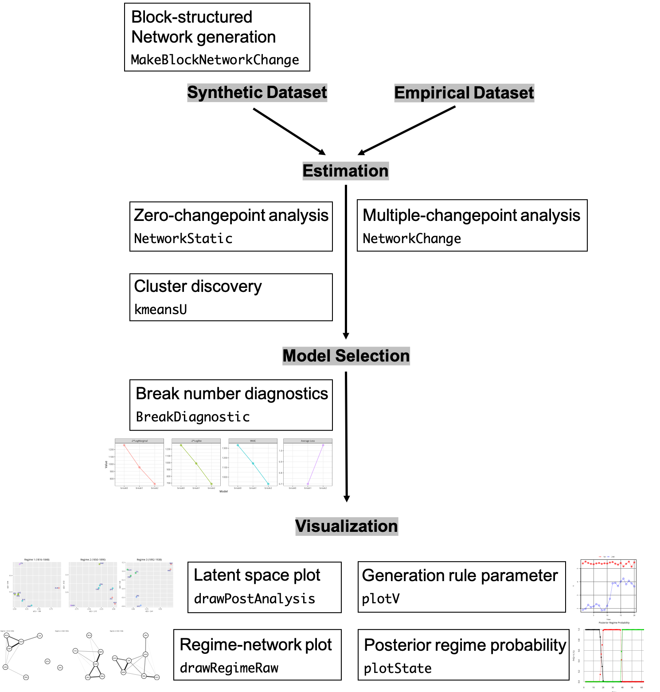

\newcommand{\Rlang}{\proglang{R}}
\newcommand{\NC}{\pkg{NetworkChange}}

\newcommand{\A}{\mathcal{A}}
\newcommand{\B}{\mathcal{B}}
\newcommand{\Y}{\mathbf{Y}}
\newcommand{\Z}{\mathbf{Z}}
\renewcommand{\E}{\mathbf{E}}
\newcommand{\M}{\mathbf{M}}
\newcommand{\U}{\mathbf{U}}
\newcommand{\V}{\mathbf{V}}
\renewcommand{\L}{\mathbf{L}}
\renewcommand{\u}{\mathbf{u}}
\renewcommand{\v}{\mathbf{v}}
\renewcommand{\l}{\boldsymbol{\lambda}}
\newcommand{\z}{\mathbf{z}}
\newcommand{\y}{\mathbf{y}}
\newcommand{\x}{\mathbf{x}}
\newcommand{\X}{\mathbf{X}}
\newcommand{\W}{\mathbf{W}}
\newcommand{\F}{\mathbf{F}}
\newcommand{\G}{\mathbf{G}}
\newcommand{\R}{\mathbf{R}}
\def\real{\mathbb{R}}
\newcommand{\s}{\mathbf{s}}
\renewcommand{\S}{\mathbf{S}}
\renewcommand{\P}{\mathbf{P}}
\newcommand{\Sig}{\boldsymbol{\Sigma}}
\renewcommand{\a}{\alpha}
\renewcommand{\b}{\boldsymbol{\beta}}
\renewcommand{\t}{\boldsymbol{\theta}}
\newcommand{\T}{\boldsymbol{\Theta}}
\newcommand{\mb}{\mathbf}
\newcommand{\RD}{\mathbf{R}^{D}}
\newcommand{\e}{\boldsymbol{\varepsilon}}
\renewcommand{\r}{\rho}
\newcommand{\g}{\boldsymbol{\gamma}}
\renewcommand{\d}{\boldsymbol{\delta}}
\newcommand{\bs}{\boldsymbol}
\newcommand{\normdist}[2]{\ensuremath{\mathcal{N}(#1,#2)}}
\newcommand{\normdistk}[3]{\ensuremath{\mathcal{N}_{#3}(#1,#2)}}
\newcommand{\wish}[2]{\ensuremath{\mathcal{W}(#1,#2)}}
\newcommand{\invwish}[2]{\ensuremath{\mathcal{IW}(#1,#2)}}
\newcommand{\gamdist}[2]{\ensuremath{\mathcal{G}(#1,#2)}}
\newcommand{\invgam}[2]{\ensuremath{\mathcal{IG}(#1,#2)}}
\newcommand{\studt}[3]{\ensuremath{t_{#3}(#1,#2)}}
\newcommand{\binomial}[2]{\ensuremath{\mathcal{B}in(#1,#2)}}
\newcommand{\bern}[1]{\ensuremath{\mathcal{B}ernoulli(#1)}}
\newcommand{\diri}[1]{\ensuremath{\mathcal{D}irichlet(#1)}}
\newcommand{\unif}[2]{\ensuremath{\mathcal{U}(#1,#2)}}
\newcommand{\chisqr}[1]{\ensuremath{\chi_{#1}^{2}}}
\newcommand{\invchisqr}[1]{\ensuremath{\mathcal{I}nv}\textnormal{-}\ensuremath{\chi_{#1}^{2}}}
\newcommand{\betadist}[2]{\ensuremath{\mathcal{B}eta(#1,#2)}}
\newcommand{\poisson}[1]{\ensuremath{\mathcal{P}oisson(#1)}}
\newcommand{\expo}[1]{\ensuremath{\mathcal{E}xp(#1)}}
\newcommand{\Dir}{\mathrm{Dir}}
\newcommand{\thh}{^\mathrm{th}}
\newcommand{\modtwo}{\mathrm{[mod~2]}}
\newcommand{\thetaof}[2]{\theta \langle #1;#2\rangle}
\newcommand{\Mpa}{M_\mathrm{P,A}}
\newcommand{\Ma}{M_\mathrm{A}}
\newcommand{\rjaccept}{\mathcal{A}}

```{r setup, include=FALSE}
rm(list=ls())
knitr::opts_chunk$set(echo = TRUE)
require(NetworkChange)
require(sna)
require(ggnet)
```

  \pkg{NetworkChange} is an \proglang{R} package that detects structural changes in longitudinal network data using the latent space approach. Based on the Bayesian multi-array representation of longitudinal networks \citep{Hoff2011, Hoff2015}, \pkg{NetworkChange} performs Bayesian hidden Markov analysis to discover changes in structural network features across temporal layers. \pkg{NetworkChange} can handle various forms of network changes such as block-splitting, block-merging, and core-periphery changes. \pkg{NetworkChange} also provides functions for model diagnostics using WAIC, average loss, and log marginal likelihoods as well as visualization tools for dynamic analysis results of longitudinal networks.


```{r message=FALSE, warning=FALSE}
library(NetworkChange)
```

# Introduction
Many recorded network data span over a long period of time. Researchers often wish to detect "structural changes," "turning points," or "critical junctures" from these network data to answer substantively important questions. For example, the evolution of military alliance networks in international politics has been known to experience several breaks due to world wars and the end of Cold War. However, to this date, statistical methods to uncover network changes have been few and far between.

\NC\ is an \Rlang\ package to detect structural changes in longitudinal network data using the latent space approach. Based on the Bayesian multi-array representation of longitudinal network data \citep{Hoff2008, Hoff2015}, \NC\ performs Bayesian hidden Markov analysis to discover changes in structural network features.

```{r, echo=FALSE, fig.cap="\\label{fig:list}Summary of selected features and functions of the package.", out.width = '100%'}

```

Existing approaches to dynamic network modeling can be classified into two classes. The first set of approaches extend a static network analysis framework by imposing smooth topological changes over time or applying completely indepedent models for each network snapshot \citep{Robins2001, Hanneke2010, Desmarais2012, Snijders2006, Snijders2010,  Westveld2011, Ward2013}. The second set of approaches constitute the literature on "network change-point detection," the goal of which is similar to ours. For example, \cite{Cribben2016} introduces a two-step approach to network change-point detection by comparing engeivectors of time-specific network Laplacian matrices. \cite{Guo2007} and \cite{Wang2014} develop methods that allow parameter values of exponential random graph models (ERGMs) to change over time. However, these methods rely heavily on heuristic approaches to detect changes in network data, lack a fully probabilistic modeling framework to account for the dynamic process, or fail to provide principled model diagnostic tools.

\NC\ is distinct from the aforementioned approaches in two significant ways. First, we incorporate \cite{Hoff2011, Hoff2015}'s multilinear tensor regression model (MTRM) to devise our dynamic network model. As we will see in details, MTRM factorizes longitudinal networks into node-specific (or row and column) random effects and time-specific (or layer-specific) random effects. Second, \NC\ utilizes hidden Markov model (HMM) to accommodate the change-point process. The conditional independence assumption in HMM captures a set of multiple unspecified changes in the latent node traits in input data.

Figure \ref{fig:list} provides a schematic illustration of selected features in \NC\. \NC\ can handle various forms of network changes such as block-splitting, block-merging, and core-periphery transitions for an arbitrary number of changes. In addition to estimating main parameters of interest including latent node traits, generation rule parameters, and the timing of changes, \NC\ provides functions for model diagnostics using WAIC, average loss, and log marginal likelihoods. \NC\ also provides visualization tools for dynamic network data.

# Model

## Network notations

Longitudinal networks are network data repeatedly observed for the same set of nodes over a period of time. Let $\mathbf{Y}_t$ be a real-valued $N \times N$ symmetric network data set (\emph{i.e.} $Y_{ijt}=Y_{jit}$ $\forall i,j,t$) observed at $t$ for $N$ nodes. For a set of time points $t = 1, 2, \ldots, T$, the collection of $\mathbf{Y}_t$, denoted as $\mathcal{Y}$, forms an $N \times N \times T$ array. $Y_{ijt}$ indicates the connection between node $i$ and node $j$ at the $t$th slice. Longitudinal network data can be considered as a special type of multilayer network data where one mode of the layers is ordered sequentially.

```{r pressure, echo=FALSE, fig.cap="\\label{fig:ex}An example longitudinal network data consisting of 3 temporal regimes.", out.width = '100%'}
knitr::include_graphics("ex_fig.png")
```
Figure \ref{fig:ex} displays an example longitudinal network data consisting of $T=7$ temporal snapshots and $N=100$ nodes. In this particular example, readers can easily notice that there are $3$ regimes for the sets of data generating parameters. While $t=\{1,2\}$ layers contain networks with 2 asymmetrically sized clusters, networks in layers $t=\{3,4,5\}$ exhibit a split of the larger cluster in $t=\{1,2\}$ into $2$, resulting in $3$ similar-sized clusters.  In the final regime ($t=\{6,7\}$), the networks are evenly divided into 2 equal-sized clusters. \NC\'s main objective is to uncover such latent regimes through Bayesian inference.

The latent approach to network data has been proven to be a highly generalizable and flexible modeling strategy for uncovering various network effects. The latent space models treat a realized network as a function of latent node positions and a linear function of covariates. For example, using a Euclidean distance formulation \citep{hoff2002latent}, we can model an adjacency matrix ($Y_{i,j}$) as
\begin{equation}\label{dist2}
\text{log odds}(Y_{i,j}=1|u_i,u_j,  \x_{i,j}, \alpha, \beta) = \alpha+\x_{i,j}\pmb{\beta}-|u_i-u_j|.
\end{equation}
The log odd of having a link for a binary symmetric network equals a linear function of $\x_{i,j}$ and the latent distance between nodes $i$ and $j$. $\x_{i,j}$ is a vector of covariates for $i$ and $j$, and $\pmb{\beta}$ is their coefficients. In this formulation, proximate nodes are considered to share homogeneous latent traits while distant nodes are considered to have heterogenous latent traits.

Different from Equation \ref{dist2}, multilayer network data pose a special challenge to the latent approach to network data due to heterogeneous network generation rules. Each network layer may have different network generation rules so that uncovering a common latent space is not feasible without accounting for heterogeneous network generation rules. In Equation \ref{dist2}, the recovered latent space is limited to discover node groups with high intra-group connections (\emph{i.e.} homophilous connections). On the contrary, our revised formulation, introduced in the next section, overcomes such limitation, accommodating a diverse set of network generation rules.

## Multilinear tensor regression model
In order to overcome the problem of heterogeneous network generation rules, \cite{Hoff2011, Hoff2015} proposed a multilinear tensor regression model (MTRM) based on multiway tensor decomposition of multilayer network data.

Let $\{z_{i,j,t}\}$ be a continuous latent variable that captures the link probability between $i$ and $j$ observed at time $t$ and $\x_{i,j,t}$ be a vector of known covariates affecting $\{z_{i,j,t}\}$. The multilayer exchangeability theorem \citep{hoff2009} allows us to model network connections as a function of covariates, node-specific random effects ($\{\u_1, \ldots, \u_N\}$) and a diagonal matrix of time-specific random effects ($\V_t$):
\begin{eqnarray}
\Pr(y_{i,j,t} = 1|  \x_{i,j,t}, \u_i, \u_j, \v_t)&=& \Phi(z_{i,j,t} )\\\label{eq1}
z_{i,j,t} &=& \x_{i,j,t}\b + \u_i^T\V_t \u_j + \epsilon_{i,j,t}\\
% \b_k&\sim& \normdist{\b}{\sigma^2_{\beta}}\\
\epsilon_{i,j,t} &\sim& \normdist{0}{1}
\end{eqnarray}
where $\{\u_1, \ldots, \u_N\}$ represent (time-constant) $R$-dimensional latent node positions and $\V_t = \begin{bmatrix} v_{1,t} & \cdots & 0 \\ \vdots & \ddots & \vdots \\ 0 & \cdots & v_{R,t}\end{bmatrix}$ is a diagonal matrix of (time-varying) network generation rules.

In a 2-dimensional latent space, $\u_i = (u_{i,1}, u_{i,2})$ indicates node $i$'s latent position, and $\u_i^T\V_1 \u_j$ represents the latent connection probability between node $i$ and node $j$ at time $1$.
This multiplicative decomposition is highly useful for the joint estimation of \emph{heterogeneous network generation rules} in conjunction with \emph{common latent node positions}.

## Hidden Markov model for network changepoint detection
\cite{Park2019} develop a hidden Markov network changepoint model (HNC) that models the latent space of longitudinal network data to follow a hidden Markov process. Changes in a hidden Markov process correspond to fundamental shifts in structural properties of longitudinal networks under consideration.

The hidden Markov model (HMM) used in \cite{Park2019} has a special feature known as forward-moving (or non-ergodic) jumps in order to handle multiple changepoints. As shown by \cite{Chib1998}, a forward-moving HMM has advantages in avoiding the switching of hidden state labels thanks to the order constraint in hidden states. Let us denote $\S$ as a vector of hidden state variables where $S_t$  is an integer-valued hidden state variable at $t$
\begin{equation}
\S = \{(S_1,  \ldots, S_T) : S_t \in \{1, \ldots, M\}, t = 1, \ldots, T\},
\end{equation}
and $\P$ as a $M \times M$ transition matrix where $p_{m,m}$ is the $m$th diagonal element of $\P$ and $M$ is the number of hidden states. The transition matrix $\P$ is constructed as follows:
\begin{equation}\label{transition}
\mathbf{P} =
\begin{pmatrix}
p_{11}  & p_{12} &0         & \dots & 0\\
0       & p_{22} & p_{23}   & \dots & 0\\
\hdotsfor{5}\\
0       & 0      &  0&       p_{mm}& p_{m,m+1}\\
0       & 0      &  &        0   & 1
\end{pmatrix}
\end{equation}
where $p_{ij}=\Pr(s_t=j|s_{t-1}=i)$ is
the probability  of changing from state $i$ at time $t-1$ to state $j$ at time $t$.

Suppose $\T$ be a collection of parameters that represents a network generating process of a longitudinal network and $\mathcal{Y}$ be a degree-corrected longitudinal network data. Then, we can write the likelihood of HNC using the conditional independence assumption of the HMM:
\begin{eqnarray}
p(\mathcal{Y} | \T) &=& \int p(S_1 | \T) p(\mathbf{Y}_1| S_1, \T)  \prod_{t=2}^T \sum^{M}_{m=1} p(\mathbf{Y}_t | \T_m) \Pr(S_t = m | S_{t-1},  \T) d\S.\nonumber
% \int p(\mathcal{Y}, \S | \T) d\S\\
% &=& \int p(S_1 | \T) p(\Y_1| S_1, \T)  \prod_{t=2}^T p(\Y_t | S_t, \T) \Pr(S_t| S_{t-1},  \T) d\S\\
\end{eqnarray}

HNC can be written as
\begin{eqnarray}\label{HNC1}
	% \mathbf{Y}_{t} &=& \mathbf{Y}_t - \mathbf{\Omega}_t\\\label{eq:cp2}
	\mathbf{Y}_{t} &=&\U_{S_t} \mathbf{V}_t  \U_{S_t}^T + \mathbf{E}_t\\\label{HNC2}
	\mathbf{E}_t &\sim&  \mathcal{N}_{N \times N}(\mathbf{0}, \sigma_{S_t}^2\mathbf{I}_{N}, \mathbf{I}_N).
\end{eqnarray}

Each column vector of $\U$ and $\V$ ($\u_{i,S_t}$ and $\v_{t}$) follows a multivariate normal distribution. Hence, the prior distributions of $\U$ and $\V$ are matrix-variate normal distributions. The prior distribution of $\U$ is
\begin{eqnarray}\label{prior1}
\U_{S_t} &\equiv&  (\u_{1, S_t}, \ldots, \u_{N, S_t})\\
 \u_{i, S_t}&\sim& \mathcal{N}_{R}(\boldsymbol{\mu}_{u,S_t}, \Psi_{u, S_t})\\
\boldsymbol{\mu}_{u, S_t}|\Psi_{u, S_t} &\sim& \mathcal{N}_{R}(\boldsymbol{\mu}_{0, u_{S_t}}, \Psi_{u, S_t})\\ \label{prior4}
\Psi_{u, S_t} &\equiv& \left( \begin{array}{ccc}
 \psi_{1, u, S_t} & \ldots & 0 \\
0 & \psi_{r, u, S_t} & 0 \\
0 &  \ldots & \psi_{R, u, S_t} \end{array} \right)\\\label{prior5}
	\psi_{r, u, S_t} &\sim&\mathcal{IG}\left (\frac{u_0}{2}, \frac{u_{1}}{2}\right).
 \end{eqnarray}

And the prior distributions of $\V$ is
\begin{eqnarray}
\mathbf{V}_t &\equiv&  \left( \begin{array}{ccc}
 v_{1, t} & \ldots & 0 \\
0 & v_{r, t} & 0 \\
0 &  \ldots & v_{R, t} \end{array} \right) \\\label{prior7}
\v_{t} &\equiv&(v_{1, t}, \ldots, v_{R, t}) \\
\v_{t}&\sim& \mathcal{N}_{R}(\boldsymbol{\mu}_v, \Psi_v)\\\label{prior8}
\boldsymbol{\mu}_{v}|\Psi_{v} &\sim& \mathcal{N}_{R}(\boldsymbol{\mu}_{0, v}, \Psi_{v})\\
\Psi_{v} &=& \left( \begin{array}{ccc}
\psi_{1, v} & \ldots & 0 \\
0 & \psi_{r, v} & 0 \\
0 &  \ldots & \psi_{R, v} \end{array} \right)\\\label{prior10}
	\psi_{r, v} &\sim&\mathcal{IG}\left (\frac{v_0}{2}, \frac{v_{1}}{2}\right).
\end{eqnarray}

## Degree correction
The inferential goal of HNC is very different from that of MTRM. While MTRM aims to estimate consistent effects of external covariates by treating latent network effects as a nuisance, the inferential goal of HNC is to estimate changes in latent network effects. In other words, latent network effects are not a nuisance but a substance in network changepoint analysis.

Group structure, also known as mesoscopic network properties, is one of the most important factors that are associated with changes in the structure of longitudinal network. Notable examples of mesoscopic network properties are homophily (the tendency to link with similar others), heterophily (the tendency to link with different others) and a core-periphery structure.
One important confounder in the network group structure discovery is degree heterogeneity. The implicit assumption in the group structure discovery is that nodes having a similar role has similar expected degrees. However, the distribution of degrees in empirical networks is highly heterogeneous and skewed following a power law or exponential distributions \citep{clauset2009power}, and, hence, degree heterogeneity confounds the discovery of group structures \citep{newman2006modularity, newman2010networks, karrer2011stochastic, chaudhuri2012spectral, zhao2012consistency}.

Following the network science literature, we address this problem using an additive null model ($\mathbf{\Omega}_t$), consisting of the principal eigenvalue ($\lambda^{princ}_t=\text{max}(\vert\lambda(\mathbf{Y}_t)\vert)$) and its associated eigenvector \citep{peixoto2013eigenvalue}:
\begin{equation}\label{omega}
\Omega_{i,j,t} = \lambda^{princ}_t \tilde{\u}_{i,t} \tilde{\u}_{j,t}^{T}
\end{equation}
 where $\tilde{\u}_{it}$ is the $i$th row of the associated eigenvectors of $\mathbf{Y}_t$. In matrix form, we denote the principal eigenmatrix as $\mathbf{\Omega}_t$ for the $t$th slice.

Alternatively, one can use a modularity matrix ($M_{i,j,t}$):
\begin{equation*}\label{modul} M_{i,j,t}= y_{i,j,t}-\frac{k_i k_j}{2m}
\end{equation*}
where the total sum of link weights $m=\sum_{i=1}^{N}k_i/2$ and $k_i$ is the sum of weights for $i$ \citep{newman2004finding}.

## Model comparison
\NC\ provides three metrics for model diagnostics and break number detection for HNC: the approximate log marginal likelihood method, WAIC, and the average loss of break points.

The approximate log marginal likelihood has a direct connection with posterior model probability assuming constant prior  probabilities of competing models ($\Pr(\mathcal{M_i}) = c$ for $i = 1, \ldots, K$) constant \citep{Chib1995}. The approximate log marginal likelihood of HNC with $M$ numbers of latent states ($\mathcal{M}_M$) can be computed as follows:
\begin{eqnarray*}\nonumber
% \log \hat{p}(\B|  \mathcal{M}_k) = \log \hat{p}(\B|  \mathbf{\Theta}^*, \P^*, \mathcal{M}_k) + \log \hat{p}( \mathbf{\Theta}^*|\mathcal{M}_k) + \log \hat{p}(\P^*|\mathcal{M}_k) - \log \hat{p}(\mathbf{\Theta}^*, \P^*|\B, \mathcal{M}_k) \mathcal{N}_{N \times N}(\mathbf{B}_1|\mathbf{\Theta}_{1})\prod_{t=2}^T \Big( \mathcal{N}_{N \times N}(\mathbf{B}_t| \B_{t-1}, \mathbf{\Theta}_{S_t}) p(S_t| S_{t-1}, \P) \Big)
\log \hat{p}(\B^{\text{upper}}|  \mathcal{M}_M) &=& \underbrace{\log p(\B^{\text{upper}}|  \boldsymbol{\mu}_{u}^*, \psi_{., u}^*, \boldsymbol{\mu}_{v}^*, \psi_{., v}^*, \sigma^{2*}, \P^*, \mathcal{M}_M)}_{\textrm{the log likelihood}} \\
&& + \underbrace{\sum_{m=1}^M\log p(\boldsymbol{\mu}_{u,m}^*, \psi_{., u,m}^*, \boldsymbol{\mu}_{v,m}^*, \psi_{., v,m}^*, \sigma_m^{2*}, p_{m,m}^*|\mathcal{M}_M)}_{\textrm{the log prior density of posterior means}}\\
&& - \underbrace{\sum_{m=1}^M\log p(\boldsymbol{\mu}_{u,m}^*, \psi_{., u,m}^*, \boldsymbol{\mu}_{v,m}^*, \psi_{., v,m}^*, \sigma_m^{2*}, p_{m,m}^*|\B^{\text{upper}}, \mathcal{M}_M)}_{\textrm{the log posterior density of posterior means}}
\end{eqnarray*}
where $\{\boldsymbol{\mu}_u^*, \psi_{., u}^*, \boldsymbol{\mu}_v^*, \psi_{., v}^*, \sigma^{2*}, \P^*\}$ are posterior means of MCMC outputs.

WAIC \citep{Watanabe2010} approximates the expected log pointwise predictive density by subtracting a bias for the effective number of parameters from the sum of log pointwise predictive density. Using the formula suggested by \cite{Gelman2014},  WAIC for HNC with $M$ number of latent states ($\mathcal{M}_M$) is
\begin{eqnarray*}
 \text{WAIC}_{\mathcal{M}_M} &=& -2\Bigg(\underbrace{\sum_{t=1}^{T}\log \left [ \frac{1}{G} \sum_{g=1}^{G}p(\B_t^{\text{upper}}| \boldsymbol{\mu}_{u}^{(g)}, \psi_{., u}^{(g)}, \boldsymbol{\mu}_{v}^{(g)}, \psi_{., v}^{(g)}, \sigma^{2, (g)},  \P^{(g)},  \S^{(g)}, \mathcal{M}_M) \right ]}_{\textrm{the expected log pointwise predictive density}} - \\
 && \underbrace{\sum_{t=1}^{T}V_{g=1}^{G} \left [ \log p(\B_t^{\text{upper}}|\boldsymbol{\mu}_{u}^{(g)}, \psi_{., u}^{(g)}, \boldsymbol{\mu}_{v}^{(g)}, \psi_{., v}^{(g)}, \sigma^{2, (g)}, \P^{(g)},  \S^{(g)}, \mathcal{M}_M) \right ]}_{\textrm{bias for the effective number of parameters}} \Bigg )
 \end{eqnarray*}
 where $G$ is the MCMC simulation size, $V[\cdot]$ indicates a variance,  and  $\mathbf{\Theta}^{(g)}, \P^{(g)}$ are the $g$th simulated outputs.

Last, \NC\ provies a more heuristic tool of break number detection for models with more than one break. The idea is that the existence of redundant break points (\emph{e.g.} two breaks on a single break process) in a model generates inconsistent estimates of break points. To capture this, the average loss of break points measures average variances of simulated break points. The average loss of break points is close to 0 if simulated break points are highly stable. The formula is 
\begin{eqnarray*}
\textrm{Average Loss} &=& \frac{1}{M}\sum_{m=1}^{M}\left(\frac{1}{G}\sum_{g=1}^{G} (\bar{\tau}_m - \tau_{m}^{(g)})^2 \right)
 \end{eqnarray*}
where $G$ is the MCMC simulation size and $M$ is the total number of breaks.

# Package implementation
In this section, we explain how to use \NC\ for network changepoint analysis.

## Input network data and synthetic data generation
Input data for \NC\ takes an array form. Hence, the dimension of input data is $N \times N \times T$.  Currently, \NC\ allows longitudinal data of symmetric (\emph{i.e.} undirected) networks.

One quick way to generate a synthetic longitudinal network data set with a changepoint is to call \texttt{MakeBlockNetworkChange}. It has three clusters by default and users can choose the size of data by selecting the number of nodes in each cluster ($n$) and the length of time ($T$). For example, if one chooses $n=10$ and $T=20$, an array of $30 \times 30 \times 20$ is generated. \texttt{base.prob} is the inter-cluster link probability, and \texttt{block.prob}+\texttt{base.prob} is the intra-cluster link probability. When one sets \texttt{block.prob}$>0$, a clustered network data set is generated. If \texttt{block.prob}$=0$, we have a random network data set.
```{r networkdata, warning=FALSE, fig.showtext=TRUE}
set.seed(11173)
n <- 10 ## number of nodes in each cluster
Y <- MakeBlockNetworkChange(n=n, break.point = .5,
                            base.prob=.05, block.prob=.7,
                            T=20, type ="split")
dim(Y)
```

The above code generates a longitudinal network data set with a changepoint in the middle (\texttt{break.point}$=0.5$). We specify the type of network change as a block-splitting change (\texttt{type ="split"}) where the initial two cluster network splits into three clusters.

Currently, \texttt{MakeBlockNetworkChange} provides five different options of network changes (\texttt{type}):  "constant", "merge", "split", "merge-split", and "split-merge." If "constant" is chosen, the number of breaks is zero. If "merge" or "split" is chosen, the number of breaks is one. If either "merge-split" or "split-merge" is chosen, the number of breaks is two.

Users can use \texttt{plotnetarray} to visualize the longitudinal network data. The resulting plot shows a selected number of equi-distant time-specific networks. By default, \texttt{n.graph} is 4. Users can change plot settings by changing options in \pkg{ggnet}.

```{r, fig.cap="\\label{fig:synth1}A synthetic longitudinal network data set generated using the block-splitting setting.", message=FALSE, warning=FALSE, fig.width = 6, fig.height = 6, fig.showtext=TRUE, fig.pos = 'ht'}
plotnetarray(Y)
```
A block-merged data set can be generated by settting \texttt{type ="merge"} of \texttt{MakeBlockNetworkChange}. We draw 4 snapshots using \texttt{plotnetarray}.
```{r, fig.cap="\\label{fig:synth2}A synthetic longitudinal network data set generated using the block-merging setting.", message=FALSE, warning=FALSE, fig.width = 6, fig.height = 6, fig.showtext=FALSE,fig.pos = 'ht'}
set.seed(11173)
Ymerge <- MakeBlockNetworkChange(n=n, break.point = .5,
                               base.prob=.05, block.prob=.7,
                               T=20, type ="merge")
plotnetarray(Ymerge)
```

## Latent space discovery
In this section, We estimate the chagepoints of the block-splitting data set \texttt{Y} generated above. We fit a HNC using the principal eigen-matrix for degree correction.
```{r estimation}
G <- 100
Yout <-  NetworkChange(Y, R=2, m=1, mcmc=G, burnin=G, verbose=0)
```
We then use \texttt{drawPostAnalysis} to draw latent node positions obtained from HNC. We also highlight the latent cluster structure using the $k$-means clustering method over the estimated latent node positions of each regime. \texttt{drawPostAnalysis} provides an option to include k-means clustering results of the latent node positions for each regime. \texttt{n.cluster} sets the number of clusters in each regime. The clustering results are depicted by assigning unique colors over the clusters. These two functions, plotting the latent node coordinates and k-means clustering, can also be applied separately by using \texttt{plotU} and \texttt{kmeansU} respectively.
```{r, fig.cap="\\label{fig:positions}Latent Node Positions obtained using HNC", message=FALSE, warning=FALSE, fig.width = 6, fig.height = 3, fig.showtext=TRUE, fig.pos = 'ht'}
Ydraw <- drawPostAnalysis(Yout, Y, n.cluster=c(2,3))
multiplot(plotlist=Ydraw, cols=2)
```
As shown by the difference between the distributions of the latent node traits in the two graphs of Figure \ref{fig:positions}, the clusters in regime 1 can be clearly distinguished by their coordinates on the first dimension whereas both dimensional coordinates are required to distinguish the three clusters in regime 2.

Such transition of the group structure can be easily depicted by plotting the change of the network generation rule parameters ($\v_t$) over time. \texttt{plotV} allows one to draw such patterns. While the first dimensional generation rule parameter $v_1$ exhibits constaly high values over the entire period, the second dimensional generation rule parameter rises dramatically near $t=10$, the ground truth changepoint .

```{r, fig.cap="\\label{fig:plotV}Generation rule parameter $v_t$ over time.", warning=FALSE, fig.width = 5, fig.height = 3.5, fig.pos = 'ht', fig.showtext=TRUE}
plotV(Yout, cex=2)
```

## Break number diagnostics

Although the above analysis shows suggestive evidence in favor of a single network changepoint, it does not provide a statistical judgement criterion for determining the break number parameter of HNC. Model diagnostics is required to coose an appropriate number of breaks and derive the final modeling result.

\texttt{BreakDiagnostic} allows one to check a statistically supported number of breaks by fitting multiple HNC models with a varying number of breaks. \texttt{break.upper} setting allows one to choose the upper limit of break numbers to be examined.
```{r diag0, warning=FALSE}
set.seed(1223)
G <- 100
detect <- BreakDiagnostic(Y, R=2, mcmc=G, burnin=G, verbose=0, break.upper=3)
```

Users can draw plots of diagnostic results by calling the first element of the test object.
```{r, warning=FALSE, fig.cap="\\label{fig:diagnostic}Break number diagnostics for synthetic block-splitting data.", warning=FALSE, fig.pos = 'ht', out.width = "100%", fig.width = 12, fig.height = 3, fig.showtext=TRUE}
detect[[1]]
```
Otherwise, users can print out the numerical results which is stored in the second element of the test object.
```{r diag2, fig.showtext=TRUE}
print(detect[[2]])
```
All diagnostic measures clearly indicate that the number of breaks in the synthetic data is one, agreeing with that of the synthetic data generating process.

# Empirical data analysis example
In this section, we analyze changes in the international military alliance network among major powers. The data set is originally from \cite{Gibler2009} and users can call this data set by \texttt{data(MajorAlly)}.

Our goal in this section is to detect structural changes in the longitudinal alliance network among major powers using HNC.  We follow the COW dataset's coding of "major powers" (the United Kingdom,  Germany, Austria-Hungary, France, Italy, Russia, the United States, Japan, and China) in the analysis. We aggregated every 2 year network from the original annual binary networks to increase the density of each layer.

Scholars of international relations have long emphasized that the formation of military alliance is not just a dyadic event but a systemic phenomenon. A simple reason is that a state forms an alliance treaty with another state in order to prevent an aggression from a third party or to check the growing power of a third party. Also, alliance formation by a pair of countries generates externalities to other countries by changing the balance of military capabilities or perceived threats among states.

The systemic nature of alliance formation is well summarized by \cite{Snyder1997}: \begin{quote}
when Bismarck made his alliance with Austria in 1879, he acquired Great Britain as a ``sleeping partner" owing to the coincidence of British and Austrian interests in the Near East. The Franco-Russian alliance of 1894 illustrates a negative externality. Although formally directed at the Triple Alliance of Germany, Austria, and Italy, it worked against Britain, which moved closer to the Triple Alliance because of colonial conflicts with France and Russian \cite[46]{Snyder1997}.
\end{quote}

```{r ally}
data(MajorAlly)
Y <- MajorAlly
time <- dim(Y)[3]
drop.state <- c(which(colnames(Y) == "USA"), which(colnames(Y) == "CHN"))
newY <- Y[-drop.state, -drop.state, 1:62]
```

First, we fit a pilot model to elicit reasonable inverse gamma prior values for $\v_t$ ($v_0$ and $v_1$).
```{r test}
G <- 100
set.seed(1990)
test.run <- NetworkStatic(newY, R=2, mcmc=G, burnin=G, verbose=0,
                          v0=10, v1=time*2)
V <- attr(test.run, "V")
sigma.mu = abs(mean(apply(V, 2, mean)))
sigma.var = 10*mean(apply(V, 2, var))
v0 <- 4 + 2 * (sigma.mu^2/sigma.var)
v1 <- 2 * sigma.mu * (v0/2 - 1)
```

Then, we diagnose the break number by comparing model-fits of several models with a varying number of breaks.
```{r, warning=FALSE, fig.cap="\\label{fig:diagnosticsnew}Break number diagnostics for the allaince data set.", warning=FALSE, fig.pos = 'ht', out.width = "100%", fig.width = 12, fig.height = 3, fig.showtext=TRUE}
set.seed(11223);
detect2 <- BreakDiagnostic(newY, R=2, break.upper=2,
                           mcmc=G, burnin=G, verbose=0,
                           v0=v0, v1=v1)
detect2[[1]]
```

The test results from WAIC, log marginal likelihood, and average loss indicate that HNC with two breaks is most reasonable.

Based on the test result, we fit the HNC with two breaks to the major power alliance network and save the result in \Rlang\ object \texttt{fit}.
```{r hncally}
G <- 100
K <- dim(newY)
m <- 2
initial.s <- sort(rep(1:(m+1), length=K[[3]]))
set.seed(11223);
fit <- NetworkChange(newY, R=2, m=m, mcmc=G, initial.s = initial.s,
                     burnin=G, verbose=0, v0=v0, v1=v1)
```

First, we can examine transitions of hidden regimes by looking at posterior state probabilities ($p(\S | \mathcal{Y}, \Theta)$) over time. \texttt{plotState} in \pkg{MCMCpack} provides a function to draw the posterior state probabilities from changepoint analysis results. Since our input data is an array, we need to change the input data as a vector.
```{r, warning=FALSE, fig.cap="\\label{fig:regimeprob}Posterior Regime Probability.", fig.pos = 'ht', out.width = "70%", fig.width = 5.5, fig.height = 4, fig.showtext=TRUE}
attr(fit, "y") <- 1:K[[3]]
plotState(fit, start=1)
```

Next, we draw regime-specific latent node positions of major powers using \texttt{drawPostAnalysis}. Users can choose the number of clusters in each regime by \texttt{n.cluster}.
```{r, warning=FALSE, fig.cap="\\label{fig:postanalysis}Estimated mean of latent node positions for the recovered 3 regimes.", fig.pos = 'ht', out.width = "100%", fig.width = 12, fig.height = 4, fig.showtext=TRUE}
p.list <- drawPostAnalysis(fit, newY, n.cluster=c(4, 4, 3))
multiplot(plotlist = p.list, cols=3)
```

Then, using \texttt{drawRegimeRaw}, we can visualize original network connections for each regime by collapsing network data within each regime.
```{r, warning=FALSE, fig.cap="\\label{fig:regimeraw}Collapsed regime-specific networks.", warning=FALSE, fig.pos = 'ht', out.width = "100%", fig.width = 12, fig.height = 4, fig.showtext=TRUE}
drawRegimeRaw(fit, newY)
```

The results are highly interesting to scholars of international relations and history. We discuss the results in details in \cite{Park2019}. One of the most interesting findings is the centrality of Austria-Hungary (AUH) during the first two regimes. Austria-Hungary played a role of broker that connected other major powers between 1816 and 1890. This period roughly overlaps with "the age of  Metternich" (1815-1848) \citep{Rothenberg1968}. Throughout the first two regimes, the network position of Austria-Hungary remained highly critical in the sense that the removal of Austria-Hungary would have made the major power alliance network almost completely disconnected. In the language of social network analysis, Austria-Hungary filled a "structural hole" in the major power alliance network at the time, playing the role of broker \citep{Burt2009}.

Identifying hidden regimes of the military alliance network makes it clear the central role of Austria-Hungary during the first two regimes in the military alliance network among major powers.

# Conclusions

In this paper, we introduced \NC\ that implements Bayesian changepoint analysis for longitudinal network data. \NC\ is based on the multilinear decomposition of tensor data \citep{Hoff2008, Hoff2015} that allows the joint estimation of common latent node positions and heterogenous network generation rules through 3-way factorization.

We showed how \NC\ successfully uncovers changes in the block structure of longitudinal network data by identifying latent node positions and their changes at the same time. \NC\ provides a variety of functions to estimate and diagnose changepoints. Also, \NC\ offers a set of visualization tools to interpret estimation results.

We believe that \NC\ will increase the capacity for longitudinal analysis of network data in various fields, not limited to social sciences.

# References
